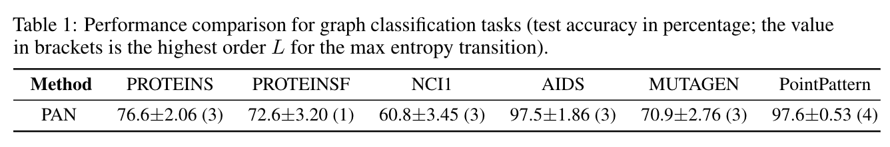

# Path Integral Based Convolution and Pooling for Graph Neural Networks

This repository is the official implementation of [Path Integral Based Convolution and Pooling for Graph Neural Networks](https://arxiv.org/abs/). 

> 📋Optional: include a graphic explaining your approach/main result, bibtex entry, link to demos, blog posts and tutorials

## Requirements

To install requirements:

```setup
pip install -r requirements.txt
```

## Training and Evaluation

To train and test the model(s) in the paper, run the following command. We provide the codes for PAN on three benchmarks in Table 1 and the new dataset PointPattern. The dataset will be downloaded and preprocessed before training. The running environment is recommended in a GPU server.

PAN on Graph classification benchmark datasets; dataname to be replaced by PROTEINS, PROTEINSF, NCI1, AIDS, MUTAGEN
```
python pan_benchmark.py --dataname --L 3 --runs 10
```
PAN on PointPattern classification task
```
python pan_pointpattern.py --phi 0.3 --L 4 --runs 10
```
Other hyperparameters: --batch_size, --learning_rate, --weight_decay, --pool_ratio, --nhid, --epochs

## Results

Our model PAN achieves the following performance on graph classification benchmark datasets MUTAG, PROTEINSF and NCI1, and our new graph classification dataset PointPattern (with phi=0.35). The table below shows the mean test accuracy with SD for 10 repetitions. Compared to existing methods such as GCNConv+TopKPool, SAGEConv+SAGPool, GATConv+EdgePool, with the same network architecture, the PAN achieves top test accuracy on most of these datasets. The results are obtained using the above .py programs. The test results on other benchmarks and comparison with the results of other methods can be seen in the paper.



> 📋Include a table of results from your paper, and link back to the leaderboard for clarity and context. If your main result is a figure, include that figure and link to the command or notebook to reproduce it. 


## Contributing
Copyright (c) <2020> <NeurIPS>

Permission is hereby granted, free of charge, to any person obtaining a copy
of this software and associated documentation files (the "Software"), to deal
in the Software without restriction, including without limitation the rights
to use, copy, modify, merge, publish, distribute, sublicense, and/or sell
copies of the Software, and to permit persons to whom the Software is
furnished to do so, subject to the following conditions:

The above copyright notice and this permission notice shall be included in all
copies or substantial portions of the Software.

THE SOFTWARE IS PROVIDED "AS IS", WITHOUT WARRANTY OF ANY KIND, EXPRESS OR
IMPLIED, INCLUDING BUT NOT LIMITED TO THE WARRANTIES OF MERCHANTABILITY,
FITNESS FOR A PARTICULAR PURPOSE AND NONINFRINGEMENT. IN NO EVENT SHALL THE
AUTHORS OR COPYRIGHT HOLDERS BE LIABLE FOR ANY CLAIM, DAMAGES OR OTHER
LIABILITY, WHETHER IN AN ACTION OF CONTRACT, TORT OR OTHERWISE, ARISING FROM,
OUT OF OR IN CONNECTION WITH THE SOFTWARE OR THE USE OR OTHER DEALINGS IN THE
SOFTWARE.
